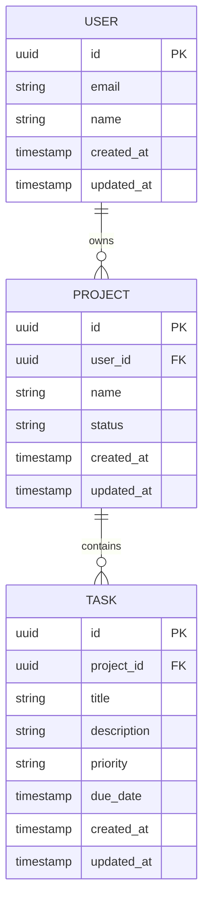

# Database Documentation Template

> Template cho database documentation. Sử dụng khi document database schema.

## Overview

[Brief description of the database]

## Schema Overview

### Entity Relationship Diagram



## Tables

### users

| Column | Type | Constraints | Description |
|--------|------|-------------|-------------|
| id | UUID | PK, DEFAULT gen_random_uuid() | Primary key |
| email | VARCHAR(255) | UNIQUE, NOT NULL | User email |
| name | VARCHAR(100) | NOT NULL | Display name |
| avatar_url | VARCHAR(500) | NULL | Profile picture URL |
| created_at | TIMESTAMP | DEFAULT NOW() | Creation time |
| updated_at | TIMESTAMP | DEFAULT NOW() | Last update |

**Indexes:**
- `idx_users_email` ON `users(email)`

**Foreign Keys:**
- None

---

### projects

| Column | Type | Constraints | Description |
|--------|------|-------------|-------------|
| id | UUID | PK, DEFAULT gen_random_uuid() | Primary key |
| user_id | UUID | FK → users(id), NOT NULL | Owner |
| name | VARCHAR(200) | NOT NULL | Project name |
| description | TEXT | NULL | Project description |
| status | VARCHAR(20) | DEFAULT 'active' | Status (active/archived) |
| created_at | TIMESTAMP | DEFAULT NOW() | Creation time |
| updated_at | TIMESTAMP | DEFAULT NOW() | Last update |

**Indexes:**
- `idx_projects_user_id` ON `projects(user_id)`
- `idx_projects_status` ON `projects(status)`

**Foreign Keys:**
- `user_id` → `users(id)` ON DELETE CASCADE

---

### tasks

| Column | Type | Constraints | Description |
|--------|------|-------------|-------------|
| id | UUID | PK, DEFAULT gen_random_uuid() | Primary key |
| project_id | UUID | FK → projects(id), NOT NULL | Parent project |
| title | VARCHAR(300) | NOT NULL | Task title |
| description | TEXT | NULL | Task details |
| priority | VARCHAR(10) | DEFAULT 'medium' | P0/P1/P2/P3 |
| status | VARCHAR(20) | DEFAULT 'todo' | todo/in_progress/done |
| due_date | TIMESTAMP | NULL | Due date |
| created_at | TIMESTAMP | DEFAULT NOW() | Creation time |
| updated_at | TIMESTAMP | DEFAULT NOW() | Last update |

**Indexes:**
- `idx_tasks_project_id` ON `tasks(project_id)`
- `idx_tasks_status` ON `tasks(status)`
- `idx_tasks_priority` ON `tasks(priority)`
- `idx_tasks_due_date` ON `tasks(due_date)`

**Foreign Keys:**
- `project_id` → `projects(id)` ON DELETE CASCADE

## Migrations

### Migration: 001_create_users

```sql
-- Create users table
CREATE TABLE users (
    id UUID PRIMARY KEY DEFAULT gen_random_uuid(),
    email VARCHAR(255) UNIQUE NOT NULL,
    name VARCHAR(100) NOT NULL,
    avatar_url VARCHAR(500),
    created_at TIMESTAMP DEFAULT NOW(),
    updated_at TIMESTAMP DEFAULT NOW()
);

CREATE INDEX idx_users_email ON users(email);
```

### Migration: 002_create_projects

```sql
-- Create projects table
CREATE TABLE projects (
    id UUID PRIMARY KEY DEFAULT gen_random_uuid(),
    user_id UUID NOT NULL REFERENCES users(id) ON DELETE CASCADE,
    name VARCHAR(200) NOT NULL,
    description TEXT,
    status VARCHAR(20) DEFAULT 'active',
    created_at TIMESTAMP DEFAULT NOW(),
    updated_at TIMESTAMP DEFAULT NOW()
);

CREATE INDEX idx_projects_user_id ON projects(user_id);
CREATE INDEX idx_projects_status ON projects(status);
```

### Migration: 003_create_tasks

```sql
-- Create tasks table
CREATE TABLE tasks (
    id UUID PRIMARY KEY DEFAULT gen_random_uuid(),
    project_id UUID NOT NULL REFERENCES projects(id) ON DELETE CASCADE,
    title VARCHAR(300) NOT NULL,
    description TEXT,
    priority VARCHAR(10) DEFAULT 'medium',
    status VARCHAR(20) DEFAULT 'todo',
    due_date TIMESTAMP,
    created_at TIMESTAMP DEFAULT NOW(),
    updated_at TIMESTAMP DEFAULT NOW()
);

CREATE INDEX idx_tasks_project_id ON tasks(project_id);
CREATE INDEX idx_tasks_status ON tasks(status);
CREATE INDEX idx_tasks_priority ON tasks(priority);
CREATE INDEX idx_tasks_due_date ON tasks(due_date);
```

## Data Dictionary

### Enum Values

| Table | Column | Values |
|-------|--------|--------|
| projects | status | active, archived |
| tasks | priority | P0, P1, P2, P3 |
| tasks | status | todo, in_progress, done |

## Performance Considerations

### Query Optimization

| Query | Optimization | Index Used |
|-------|-------------|------------|
| Get user's projects | Filter by user_id | idx_projects_user_id |
| Get project's tasks | Filter by project_id | idx_tasks_project_id |
| Get tasks by status | Filter by status | idx_tasks_status |
| Get overdue tasks | Filter by due_date | idx_tasks_due_date |

### Partitioning Strategy

- [ ] Consider partitioning for large tables (> 10M rows)
- [ ] Partition by date for time-series data
- [ ] Use partial indexes for common queries

## Backup & Recovery

| Aspect | Strategy |
|--------|----------|
| Backup Frequency | Daily full + hourly incremental |
| Retention | 30 days |
| Recovery Point Objective (RPO) | 1 hour |
| Recovery Time Objective (RTO) | 4 hours |

## Security

| Aspect | Implementation |
|--------|---------------|
| Data Encryption | AES-256 at rest |
| Connection | TLS 1.3 |
| Secrets | Environment variables, never in code |
| PII | Encrypted fields for sensitive data |

## Changelog

| Version | Date | Changes |
|---------|------|---------|
| 1.0.0 | 2024-01-01 | Initial schema |
| 1.1.0 | 2024-02-01 | Added tasks table |
