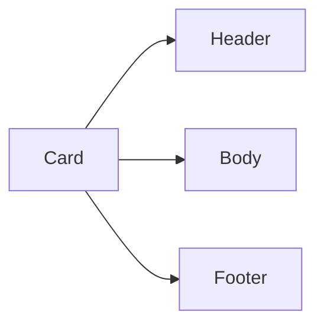

# UI/UX Documentation Template

> Template cho UI/UX documentation. Sử dụng khi document design system và components.

## Overview

[Brief description of the design system]

## Design Principles

### Core Principles

1. **Consistency** — Same patterns across all screens
2. **Clarity** — Clear hierarchy and visual feedback
3. **Efficiency** — Minimize user effort
4. **Accessibility** — WCAG 2.1 AA compliant

### Typography

| Element | Font | Size | Weight | Line Height |
|---------|------|------|--------|-------------|
| H1 | Inter | 32px | 700 | 1.2 |
| H2 | Inter | 24px | 600 | 1.3 |
| H3 | Inter | 20px | 600 | 1.4 |
| Body | Inter | 16px | 400 | 1.5 |
| Caption | Inter | 14px | 400 | 1.4 |
| Small | Inter | 12px | 400 | 1.3 |

### Color Palette

#### Primary Colors

| Name | Hex | Usage |
|------|-----|-------|
| Primary-500 | #3B82F6 | Main actions, links |
| Primary-600 | #2563EB | Hover states |
| Primary-700 | #1D4ED8 | Active states |

#### Neutral Colors

| Name | Hex | Usage |
|------|-----|-------|
| Gray-50 | #F9FAFB | Background |
| Gray-100 | #F3F4F6 | Borders |
| Gray-200 | #E5E7EB | Disabled backgrounds |
| Gray-500 | #6B7280 | Placeholder text |
| Gray-900 | #111827 | Primary text |

#### Semantic Colors

| Name | Hex | Usage |
|------|-----|-------|
| Success | #10B981 | Success states |
| Warning | #F59E0B | Warning states |
| Error | #EF4444 | Error states |
| Info | #3B82F6 | Informational |

### Spacing

| Token | Value | Usage |
|-------|-------|-------|
| xs | 4px | Tight spacing |
| sm | 8px | Small gaps |
| md | 16px | Default spacing |
| lg | 24px | Section gaps |
| xl | 32px | Large sections |
| 2xl | 48px | Page sections |

### Border Radius

| Token | Value | Usage |
|-------|-------|-------|
| sm | 4px | Small elements (inputs) |
| md | 8px | Cards, buttons |
| lg | 12px | Modals, dropdowns |
| full | 9999px | Pills, avatars |

## Components

### Button

#### Variants

| Variant | Usage |
|---------|-------|
| Primary | Main actions |
| Secondary | Secondary actions |
| Ghost | Tertiary actions |
| Destructive | Delete/danger actions |

#### Sizes

| Size | Height | Padding | Font Size |
|------|--------|---------|-----------|
| sm | 32px | 12px 16px | 14px |
| md | 40px | 12px 20px | 16px |
| lg | 48px | 16px 24px | 18px |

#### States

- [ ] Default
- [ ] Hover
- [ ] Active
- [ ] Focused
- [ ] Disabled
- [ ] Loading

#### Usage

```jsx
<Button variant="primary" size="md">
  Save Changes
</Button>
```

---

### Input

#### Variants

| Variant | Usage |
|---------|-------|
| Default | Standard text input |
| Error | Validation error state |
| Disabled | Non-editable |

#### Sizes

| Size | Height | Padding | Font Size |
|------|--------|---------|-----------|
| sm | 32px | 8px 12px | 14px |
| md | 40px | 12px 16px | 16px |
| lg | 48px | 16px 20px | 18px |

#### States

- [ ] Default
- [ ] Focused
- [ ] Error
- [ ] Disabled
- [ ] Read-only

#### Usage

```jsx
<Input
  label="Email"
  placeholder="Enter email"
  type="email"
  error="Invalid email format"
/>
```

---

### Card

#### Structure



#### Variants

| Variant | Usage |
|---------|-------|
| Default | Standard card |
| Elevated | With shadow |
| Bordered | Border only |

#### Usage

```jsx
<Card>
  <Card.Header>
    <h3>Card Title</h3>
  </Card.Header>
  <Card.Body>
    Card content
  </Card.Body>
  <Card.Footer>
    <Button>Action</Button>
  </Card.Footer>
</Card>
```

---

### Modal

#### Sizes

| Size | Width | Usage |
|------|-------|-------|
| sm | 400px | Simple confirmations |
| md | 500px | Forms |
| lg | 700px | Complex content |
| xl | 900px | Full-screen modals |

#### Usage

```jsx
<Modal isOpen={isOpen} onClose={onClose} size="md">
  <Modal.Header>Title</Modal.Header>
  <Modal.Body>Content</Modal.Body>
  <Modal.Footer>
    <Button variant="secondary" onClick={onClose}>Cancel</Button>
    <Button>Confirm</Button>
  </Modal.Footer>
</Modal>
```

---

### Table

#### Features

- [ ] Sortable columns
- [ ] Pagination
- [ ] Row selection
- [ ] Empty state
- [ ] Loading state

#### Usage

```jsx
<Table data={users} columns={columns}>
  <Table.Column key="name" header="Name" />
  <Table.Column key="email" header="Email" />
  <Table.Column key="actions" header="Actions" />
</Table>
```

---

### Navigation

#### Types

| Type | Usage |
|------|-------|
| Sidebar | Main navigation |
| Tabs | Content switching |
| Breadcrumbs | Location indicator |
| Pagination | List navigation |

## Accessibility

### WCAG 2.1 AA Compliance

| Requirement | Implementation |
|-------------|----------------|
| Color contrast | 4.5:1 for text, 3:1 for UI |
| Keyboard navigation | All interactions via keyboard |
| Focus indicators | Visible focus ring |
| Screen readers | ARIA labels, roles |
| Motion | Respect prefers-reduced-motion |

### Keyboard Navigation

| Key | Action |
|-----|--------|
| Tab | Move focus forward |
| Shift + Tab | Move focus backward |
| Enter | Activate button/link |
| Space | Activate button |
| Escape | Close modal/dropdown |

## Responsive Breakpoints

| Breakpoint | Width | Devices |
|------------|-------|---------|
| sm | 640px | Mobile landscape |
| md | 768px | Tablet |
| lg | 1024px | Desktop |
| xl | 1280px | Large desktop |
| 2xl | 1536px | Extra large |

## Changelog

| Version | Date | Changes |
|---------|------|---------|
| 1.0.0 | 2024-01-01 | Initial design system |
| 1.1.0 | 2024-02-01 | Added dark mode tokens |
