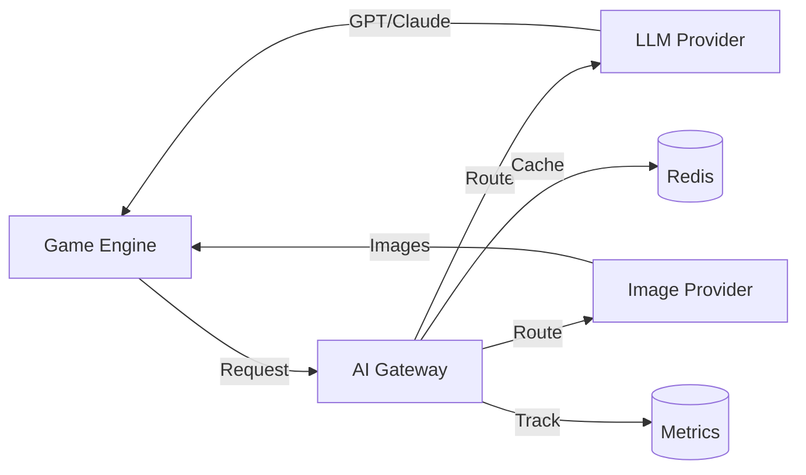

# Feature Plan: AI Game Integration

> Integrate AI services (ChatGPT, Claude, image generation) into Forgewright game builder.

## Metadata

| Field | Value |
|-------|-------|
| **Feature Name** | AI Game Integration |
| **Created** | 2026-04-10 |
| **Last Updated** | 2026-04-10 |
| **Status** | Planning |
| **Priority** | P1 (High) |
| **Estimated Effort** | 40 hours / 5 days |

## Overview

Add AI-powered features to the game builder: NPC dialogue generation, procedural content creation, image generation for game assets, and AI-assisted game design. This enables indie developers to create richer games faster.

## Goals

1. **NPC Dialogue System** — Generate dynamic NPC conversations using LLM
2. **Procedural Content** — AI-generated quests, items, lore
3. **Image Generation** — Create game sprites, backgrounds, UI elements
4. **AI Copilot** — Help users design game mechanics and levels
5. **Voice Synthesis** — Generate NPC voice lines (optional v2.0)

## Scope

### ✅ In Scope

- [ ] NPC dialogue system with context injection
- [ ] Procedural quest generation
- [ ] Procedural item/equipment generation
- [ ] Image generation pipeline (DALL-E/Stable Diffusion)
- [ ] AI copilot for game design suggestions
- [ ] Caching layer for generated content
- [ ] Cost tracking and usage limits
- [ ] Content moderation filter

### ❌ Out of Scope

- [ ] Voice synthesis (v2.0)
- [ ] Music generation (v2.0)
- [ ] Full game auto-generation (v2.0)
- [ ] Multiplayer AI opponents

## Architecture Summary

## Task Breakdown

| Task | Priority | Estimate |
|------|----------|----------|
| AI Gateway service | P0 | 8h |
| LLM provider integration | P0 | 6h |
| Image provider integration | P0 | 6h |
| NPC dialogue system | P1 | 8h |
| Procedural content | P1 | 8h |
| Caching layer | P1 | 4h |
| Usage tracking | P2 | 4h |
| Unit tests | P0 | 6h |

**Total: 50 hours (~6.25 days)**

## Success Criteria

| Criteria | Target |
|----------|--------|
| Response latency | < 3s for dialogue, < 10s for images |
| Cost per game | < $0.50 average |
| Cache hit rate | > 60% |
| Content moderation | 100% filtered |

## Timeline

```mermaid
gantt
    title AI Integration Timeline
    dateFormat X
    axisFormat %d日

    section Foundation
    AI Gateway       :done, 2026-04-10, 8h
    LLM Integration  :2026-04-11, 6h

    section Core Features
    Image Gen        :2026-04-12, 6h
    NPC Dialogue     :2026-04-13, 8h

    section Advanced
    Procedural Gen   :2026-04-14, 8h
    Caching         :2026-04-15, 4h

    section Polish
    Testing & Docs   :2026-04-16, 10h
```

