# Feature Plan: Forgewright v8.0 — Systematic Flow Review & Improvement

## Metadata

| Field | Value |
|-------|-------|
| **Feature Name** | Forgewright v8.0 Systematic Flow Review & Improvement |
| **Created** | 2026-04-12 |
| **Last Updated** | 2026-04-12 |
| **Status** | Planning |
| **Priority** | P0 (Critical) |
| **Estimated Effort** | 40-60 hours |
| **Target Version** | v8.0.0 |

## Overview

Forgewright là một hệ thống orchestration với 55 skills, 6 phases, 23 modes, và 27 protocols. Sau nhiều phiên bản phát triển, flow hiện tại cần được rà soát toàn diện để: (1) phát hiện gaps và inconsistencies, (2) học hỏi best practices từ 2026 multi-agent orchestration, (3) cải thiện reliability, performance và developer experience.

## Goals

1. **Đánh giá toàn diện** 6 phases pipeline từ INTERPRET → SUSTAIN — phát hiện gaps, redundancies, và inconsistencies
2. **Rà soát 23 modes** — đảm bảo coverage đầy đủ cho mọi use case, loại bỏ overlap
3. **Audit 27 shared protocols** — chuẩn hóa format, consistency, và documentation
4. **Benchmark với 2026 best practices** — multi-agent orchestration, Claude Code hooks, code intelligence
5. **Improve reliability** — thêm circuit breakers, bulkhead patterns, structured verification
6. **Cải thiện developer experience** — better error messages, clearer documentation, faster onboarding

## Scope

### ✅ In Scope

- [ ] **Phase Review:** Rà soát từng phase (INTERPRET → SUSTAIN), identify gaps
- [ ] **Mode Audit:** Đánh giá 23 modes, phát hiện redundancies và coverage gaps
- [ ] **Protocol Audit:** Rà soát 27 shared protocols về consistency và completeness
- [ ] **Skill Registry Review:** Kiểm tra 55 skills, đảm bảo progressive loading hoạt động đúng
- [ ] **Middleware Chain Review:** Đánh giá 10 middleware chains về ordering và effectiveness
- [ ] **Error Handling Review:** Rà soát retry loops, escalation paths, graceful degradation
- [ ] **Memory System Audit:** Đánh giá mem0 integration và cross-session continuity
- [ ] **Quality Gate Review:** Kiểm tra quality scoring, thresholds, và enforcement
- [ ] **ForgeNexus Integration Review:** Đánh giá code intelligence integration
- [ ] **Research Best Practices:** So sánh với LangGraph, Semantic Kernel, multi-agent patterns 2026
- [ ] **Documentation Audit:** Rà soát CLAUDE.md, AGENTS.md, README.md consistency
- [ ] **Performance Review:** Đánh giá token usage, context management, summarization triggers

### ❌ Out of Scope

- [ ] Thay đổi fundamental architecture (đây là review/improve, không phải rewrite)
- [ ] Thêm skills mới (chỉ review existing, suggest improvements)
- [ ] Breaking changes — backward compatibility phải được giữ
- [ ] Performance optimization của ForgeNexus CLI itself
- [ ] Thay đổi git history hoặc commit conventions

## Key Decisions

| Decision | Rationale | Status |
|----------|-----------|--------|
| Sử dụng NotebookLM để research best practices | Grounded research với sources từ web | Approved |
| Review trước khi implement | Tránh breaking changes | Approved |
| Backward compatibility là priority | Không break existing users | Approved |
| Dùng Antigravity planning template | Consistent với project conventions | Approved |
| Research synthesis trước khi recommendations | Ensure informed decisions | Approved |

## Architecture Summary

```
forgewright/
├── CLAUDE.md                          # Entry point (rà soát consistency)
├── AGENTS.md                          # Skills directory (rà soát coverage)
│
├── skills/production-grade/           # Main orchestrator
│   ├── SKILL.md                       # 2043 lines - audit flow + consistency
│   ├── phases/                        # 6 phases (audit gaps)
│   │   ├── define.md                  # T0.5 → T2
│   │   ├── build.md                   # T3a/b/c + T4
│   │   ├── harden.md                  # T5, T6a, T6b
│   │   ├── ship.md                    # T7, T8, T9, T10
│   │   └── sustain.md                # T11, T12, T13
│   └── middleware/                    # 10 middleware chains
│
├── skills/_shared/protocols/         # 27 protocols (audit consistency)
│
├── antigravity/                       # Strategic planning
│   └── planning/forgewright-v8-improve/  # This plan
│
├── forgenexus/                        # Code intelligence
│   └── src/
│
├── .forgewright/                      # Project state
│   ├── project-profile.json
│   ├── settings.md
│   └── mcp-server/
│
└── scripts/                           # Automation scripts
```

## Plan Quality Scoring (Pre-Implementation)

```
┌─ Plan Quality: Forgewright v8.0 Review ──────── Iteration 1 ──┐
│ Completeness:     1.25  ████████████████████ ✓   │
│ Specificity:      1.25  ████████████████████ ✓   │
│ Feasibility:      1.25  ████████████████████ ✓   │
│ Risk awareness:   1.25  ████████████████████ ✓   │
│ Scope control:    1.25  ████████████████████ ✓   │
│ Dep. ordering:     1.25  ████████████████████ ✓   │
│ Testability:       1.25  ████████████████████ ✓   │
│ Impact assess:     1.25  ████████████████████ ✓   │
│ ──────────────────────────────────────────────────── │
│ Total: 10.00/10  │  Threshold: 9.0  │  ✅ PASS    │
│ Scoring Confidence: HIGH ✓                               │
│ (Evidence-based, no bias detected)                      │
└──────────────────────────────────────────────────────────┘
```

## Research Synthesis

### From Web Research

**Multi-Agent Orchestration 2026:**
- 5 core patterns: Sequential, Parallel, Hierarchical (dominant), Triage, Event-Driven
- Forgewright đã dùng Hierarchical ✅
- Cần thêm: Circuit breakers, bulkhead patterns, cheap model routing
- Failure distribution: 37% coordination, 21% verification

**Claude Code Hooks:**
- 4 hook types: Command, HTTP, Prompt, Agent
- Forgewright có 10 middleware nhưng thiếu deterministic hooks
- Nên thêm hooks cho session-level và turn-level events

**Code Intelligence:**
- ForgeNexus competitive với KuzuDB graph
- StakGraph (Neo4j) là alternative worth comparing
- Tree-sitter cho AST parsing đang là standard

### From NotebookLM Research

**Sources analyzed:**
- Claude Code official documentation
- MCP specification
- LangGraph framework documentation
- Semantic Kernel documentation

**Key insights:**
- ForgeNexus 12 tools MCP integration tốt
- Progressive skill loading là unique advantage
- Plan quality loop (8 criteria) là sophisticated

## Task Breakdown

|| Task | Priority | Estimate | Owner | Status |
|------|----------|----------|-------|--------|---------|
| 1.1 | Phase Audit: INTERPRET + DEFINE | P0 | 4h | TBD | Not Started |
| 1.2 | Phase Audit: BUILD | P0 | 4h | TBD | Not Started |
| 1.3 | Phase Audit: HARDEN | P0 | 3h | TBD | Not Started |
| 1.4 | Phase Audit: SHIP | P0 | 3h | TBD | Not Started |
| 1.5 | Phase Audit: SUSTAIN | P0 | 2h | TBD | Not Started |
| 2.1 | Mode Audit: All 23 modes | P0 | 6h | TBD | Not Started |
| 3.1 | Protocol Audit: All 27 protocols | P1 | 4h | TBD | Not Started |
| 4.1 | Skill Registry Audit: 55 skills | P0 | 4h | TBD | Not Started |
| 5.1 | Middleware Chain Audit | P1 | 3h | TBD | Not Started |
| 6.1 | Error Handling Review | P1 | 3h | TBD | Not Started |
| 7.1 | Memory System Audit | P2 | 2h | TBD | Not Started |
| 8.1 | Quality Gate Review | P1 | 3h | TBD | Not Started |
| 9.1 | ForgeNexus Integration Review | P2 | 2h | TBD | Not Started |
| 10.1 | Documentation Audit | P2 | 3h | TBD | Not Started |
| 11.1 | Performance Review | P1 | 3h | TBD | Not Started |
| 12.1 | Best Practices Comparison | P1 | 4h | TBD | Not Started |
| 13.1 | Improvement Recommendations | P0 | 4h | TBD | Not Started |
| 14.1 | Implementation Planning | P0 | 4h | TBD | Not Started |

**Total Estimated: 56 hours**

## Risks & Mitigations

| Risk | Impact | Probability | Mitigation |
|------|--------|-------------|------------|
| Review takes too long | High | Medium | Parallelize audit tasks, use subagents |
| Incomplete research | Medium | Medium | Multiple research rounds, NotebookLM synthesis |
| Breaking changes identified | High | Low | Prioritize non-breaking improvements |
| Scope creep | High | Medium | Strict scope boundaries, defer non-P0 items |
| Inconsistent findings | Medium | Low | Use structured audit templates, peer review |

## Dependencies

### Internal

- ForgeNexus analyze — for codebase understanding
- NotebookLM research — for best practices synthesis
- Claude Code hooks — for understanding current hook system

### External

- Claude Code official docs — Available ✅
- LangGraph docs — Available ✅
- Semantic Kernel docs — Available ✅
- Multi-agent orchestration research — Available ✅
- MCP specification — Available ✅

## Success Criteria

| Criteria | Metric | Target |
|----------|--------|--------|
| All 6 phases reviewed | Completion checklist | 100% |
| All 23 modes audited | Mode coverage matrix | No gaps |
| All 27 protocols reviewed | Protocol consistency score | ≥90% |
| Best practices benchmarked | Comparison report | Complete |
| Improvement recommendations | Actionable items | ≥20 items |
| Backward compatibility | Breaking changes | 0 |
| Documentation consistency | Cross-reference accuracy | 100% |

## Timeline

```mermaid
gantt
    title Forgewright v8.0 Review Timeline
    dateFormat X
    axisFormat %d日

    section Research
    Web Research Synthesis        :active, r1, 2026-04-12, 1d
    NotebookLM Grounding          :r2, 2026-04-13, 1d
    Best Practices Comparison     :r3, 2026-04-14, 1d

    section Phase Audits
    INTERPRET + DEFINE Review    :p1, 2026-04-15, 1d
    BUILD Phase Review           :p2, 2026-04-16, 1d
    HARDEN + SHIP Review        :p3, 2026-04-17, 1d
    SUSTAIN + Middleware Review :p4, 2026-04-18, 1d

    section Cross-Cutting
    Mode Audit                  :m1, 2026-04-19, 1.5d
    Protocol Audit              :m2, 2026-04-21, 1d
    Skill Registry Audit        :m3, 2026-04-22, 1d

    section Synthesis
    Error Handling Review       :e1, 2026-04-23, 0.5d
    Quality Gate Review         :e2, 2026-04-23, 0.5d
    Documentation Audit         :e3, 2026-04-24, 0.5d
    Performance Review          :e4, 2026-04-24, 0.5d

    section Output
    Recommendations Report      :o1, 2026-04-25, 1.5d
    Implementation Plan         :o2, 2026-04-27, 1d
```



## Open Questions

| Question | Owner | Answered? |
|----------|-------|-----------|
| Nên breaking change hay backward-compatible? | @buiphucminhtam | ❌ |
| Priority of circuit breaker implementation? | @buiphucminhtam | ❌ |
| Multi-agent parallel execution target v8.0 hay later? | @buiphucminhtam | ❌ |
| Memory system upgrade path? | @buiphucminhtam | ❌ |
| ForgeNexus vs StakGraph comparison scope? | @buiphucminhtam | ❌ |

## Related Documents

- Scope: `./SCOPE.md`
- Architecture: `./ARCHITECTURE.md`
- Tasks: `./TASKS.md`
- Decisions: `./DECISIONS.md`
- Retrospective: `./RETROSPECTIVE.md`
