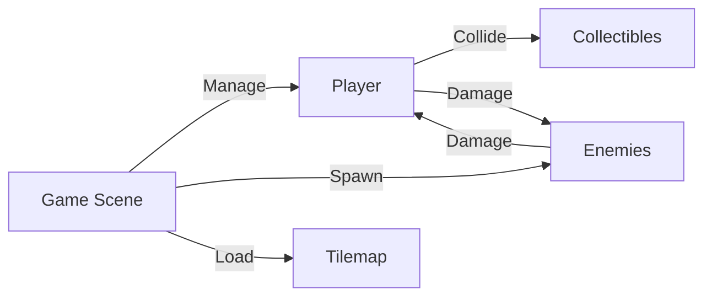

# Feature Plan: Platformer Game

> A classic 2D platformer game built with Phaser 3. Side-scrolling action with collectibles, enemies, and boss battles.

## Metadata

| Field | Value |
|-------|-------|
| **Feature Name** | Platformer Game |
| **Created** | 2026-04-10 |
| **Last Updated** | 2026-04-10 |
| **Status** | Planning |
| **Priority** | P1 (High) |
| **Estimated Effort** | 60 hours / 7.5 days |
| **Engine** | Phaser 3 |
| **Platform** | Web (HTML5) |

## Overview

A classic 2D side-scrolling platformer game featuring:
- Player character with movement, jump, and attack
- Multiple levels with increasing difficulty
- Enemies with AI behaviors
- Collectibles and scoring system
- Boss battles
- Save/load functionality

## Goals

1. **Core Movement** — Smooth player controls (left, right, jump, attack)
2. **Level Design** — 5 distinct levels with increasing difficulty
3. **Enemy AI** — Patrolling enemies, chasing enemies, flying enemies
4. **Collectibles** — Coins, power-ups, health items
5. **Boss Battles** — 2 boss encounters
6. **Audio** — Sound effects and background music
7. **Save System** — Local storage for progress

## Scope

### ✅ In Scope

- [ ] Player character with animations
- [ ] Tilemap-based level design
- [ ] Collision detection
- [ ] Enemy AI (patrol, chase, shoot)
- [ ] Collectibles (coins, gems, power-ups)
- [ ] Health system
- [ ] Score system
- [ ] 5 playable levels
- [ ] 2 boss battles
- [ ] Sound effects
- [ ] Background music
- [ ] Pause menu
- [ ] Save/load system
- [ ] Score leaderboard

### ❌ Out of Scope

- [ ] Multiplayer
- [ ] In-app purchases
- [ ] Mobile touch controls (v2.0)
- [ ] Level editor
- [ ] Custom character skins

## Architecture Summary

## Task Breakdown

| Task | Priority | Estimate |
|------|----------|----------|
| Project setup (Phaser 3) | P0 | 4h |
| Player controller | P0 | 8h |
| Tilemap & levels | P0 | 8h |
| Enemy AI system | P0 | 10h |
| Collectibles & scoring | P1 | 6h |
| Boss battles | P1 | 12h |
| Audio system | P1 | 6h |
| UI & menus | P1 | 6h |
| Save system | P2 | 4h |
| Level design (5 levels) | P1 | 12h |
| Polish & bug fixes | P1 | 8h |

**Total: 84 hours (~10.5 days)**

## Success Criteria

| Criteria | Target |
|----------|--------|
| 60 FPS on modern browsers | ✅ |
| All 5 levels playable | ✅ |
| No game-breaking bugs | ✅ |
| Audio < 50ms latency | ✅ |
| Load time < 3s | ✅ |

## Timeline

```mermaid
gantt
    title Platformer Game Timeline
    dateFormat X
    axisFormat %d日

    section Core
    Project Setup     :done, 2026-04-10, 4h
    Player Controller :active, 2026-04-10, 8h
    Tilemap System   :2026-04-11, 8h

    section Features
    Enemy AI         :2026-04-12, 10h
    Collectibles     :2026-04-13, 6h
    Boss Battles     :2026-04-14, 12h

    section Content
    Levels 1-3       :2026-04-15, 8h
    Levels 4-5       :2026-04-16, 4h

    section Polish
    Audio & UI       :2026-04-17, 12h
    Testing & Fixes  :2026-04-18, 8h
```

