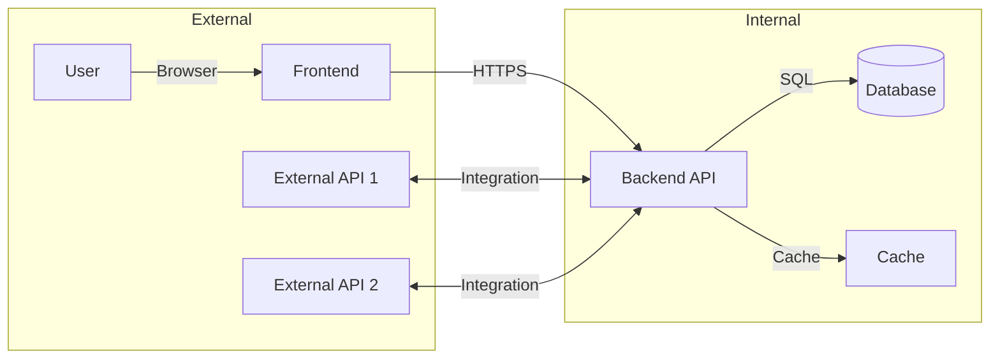
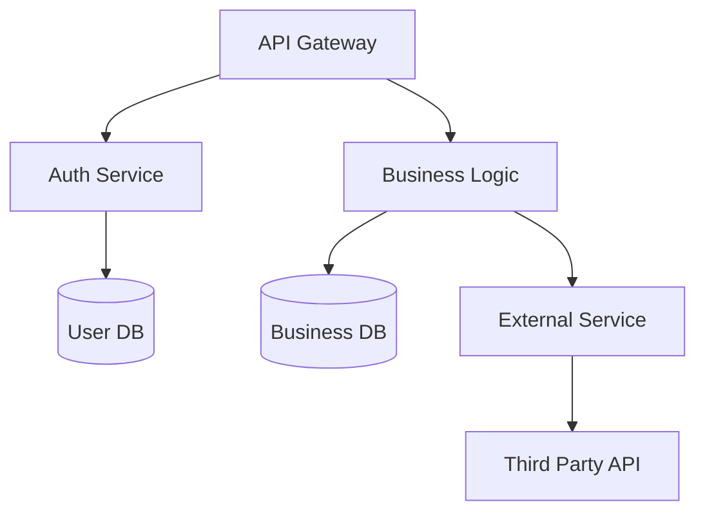
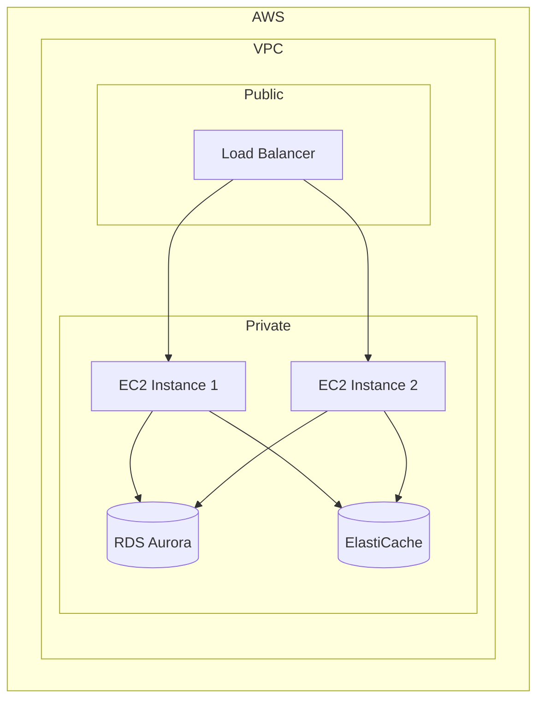

# Architecture: [Feature Name]

> Technical architecture design cho feature. Sử dụng template này để document architecture decisions.

## Overview

[Brief overview of the architecture approach]

## System Context

### Context Diagram



## Component Architecture

### Components

| Component | Responsibility | Technology | Location |
|-----------|----------------|------------|----------|
| [Component 1] | [What it does] | [Tech] | [Path] |
| [Component 2] | [What it does] | [Tech] | [Path] |
| [Component 3] | [What it does] | [Tech] | [Path] |

### Component Diagram



## Data Architecture

### Data Models

#### Entity: [Entity Name]

| Field | Type | Constraints | Description |
|-------|------|------------|-------------|
| id | UUID | PK | Unique identifier |
| [field1] | [type] | [constraints] | [description] |
| [field2] | [type] | [constraints] | [description] |
| created_at | timestamp | | Creation time |
| updated_at | timestamp | | Last update |

### Database Schema

```sql
-- [Entity Name]
CREATE TABLE [table_name] (
    id UUID PRIMARY KEY DEFAULT gen_random_uuid(),
    [columns...],
    created_at TIMESTAMP DEFAULT NOW(),
    updated_at TIMESTAMP DEFAULT NOW()
);

-- Indexes
CREATE INDEX idx_[table]_[column] ON [table_name]([column]);
```

## API Design

### Endpoints

| Method | Endpoint | Description | Request | Response |
|--------|----------|-------------|---------|----------|
| GET | /api/v1/resource | Get all | - | [Schema] |
| GET | /api/v1/resource/:id | Get one | - | [Schema] |
| POST | /api/v1/resource | Create | [Schema] | [Schema] |
| PUT | /api/v1/resource/:id | Update | [Schema] | [Schema] |
| DELETE | /api/v1/resource/:id | Delete | - | 204 |

### Request/Response Schemas

#### POST /api/v1/resource

**Request:**
```json
{
  "field1": "string (required)",
  "field2": "number (optional)",
  "field3": ["array"]
}
```

**Response (201):**
```json
{
  "id": "uuid",
  "field1": "string",
  "field2": 123,
  "createdAt": "ISO8601"
}
```

## Security Architecture

### Authentication & Authorization

| Layer | Mechanism | Implementation |
|-------|-----------|----------------|
| API | JWT Bearer Token | Authorization header |
| Session | HTTP-only Cookie | Secure flag in production |
| Rate Limiting | Token bucket | 100 req/min per user |

### Data Protection

- [ ] Data encrypted at rest (AES-256)
- [ ] Data encrypted in transit (TLS 1.3)
- [ ] Sensitive fields encrypted (PII, credentials)
- [ ] Secrets in environment variables

## Performance Architecture

### Performance Requirements

| Metric | Target | Measurement |
|--------|--------|-------------|
| Response Time (p95) | < 200ms | APM tracking |
| Throughput | 1000 RPS | Load testing |
| Availability | 99.9% | Uptime monitoring |

### Caching Strategy

| Data | Cache Strategy | TTL | Invalidation |
|------|----------------|-----|--------------|
| [Data 1] | Cache-aside | 5 min | Event-based |
| [Data 2] | Read-through | 1 hour | Time-based |

## Deployment Architecture

### Infrastructure



### Scaling Strategy

| Component | Scaling | Configuration |
|-----------|---------|---------------|
| API Servers | Auto-scaling | Min: 2, Max: 10 |
| Database | Vertical + Read Replicas | r6g.large → r6g.4xlarge |
| Cache | Cluster Mode | 3 nodes minimum |

## Error Handling

### Error Response Format

```json
{
  "error": {
    "code": "VALIDATION_ERROR",
    "message": "Human readable message",
    "details": [
      {
        "field": "email",
        "message": "Invalid email format"
      }
    ],
    "requestId": "uuid"
  }
}
```

### Error Codes

| Code | HTTP Status | Description |
|------|-------------|-------------|
| VALIDATION_ERROR | 400 | Invalid input |
| UNAUTHORIZED | 401 | Not authenticated |
| FORBIDDEN | 403 | Not authorized |
| NOT_FOUND | 404 | Resource not found |
| INTERNAL_ERROR | 500 | Server error |

## Monitoring & Observability

### Metrics

| Metric | Type | Alert Threshold |
|--------|------|----------------|
| error_rate | gauge | > 1% |
| latency_p95 | histogram | > 500ms |
| cpu_utilization | gauge | > 80% |
| memory_utilization | gauge | > 85% |

### Logging

- Structured JSON logging
- Log levels: ERROR, WARN, INFO, DEBUG
- Correlation ID for request tracing

### Tracing

- Distributed tracing with OpenTelemetry
- Span for each operation
- Export to Jaeger/Prometheus

## Related Documents

- Feature Plan: `./PLAN.md`
- Scope: `./SCOPE.md`
- Tasks: `./TASKS.md`
- Decisions: `./DECISIONS.md`
