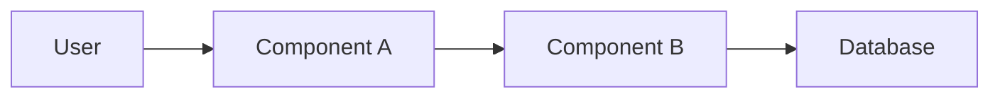

# Feature Plan: [Feature Name]

> Template chính cho feature planning. Điền thông tin theo hướng dẫn.

## Metadata

| Field | Value |
|-------|-------|
| **Feature Name** | [Tên feature] |
| **Created** | [YYYY-MM-DD] |
| **Last Updated** | [YYYY-MM-DD] |
| **Status** | Planning / In Progress / Completed |
| **Priority** | P0 (Critical) / P1 (High) / P2 (Medium) / P3 (Low) |
| **Estimated Effort** | [X] hours / [Y] days |

## Overview

[Tóm tắt 2-3 sentences về feature này làm gì và tại sao cần thiết.]

## Goals

[Mục tiêu chính của feature - có thể đo lường được]

1. [Goal 1 - SMART format]
2. [Goal 2 - SMART format]
3. [Goal 3 - SMART format]

## Scope

### ✅ In Scope

- [ ] [Item 1]
- [ ] [Item 2]
- [ ] [Item 3]

### ❌ Out of Scope

- [ ] [Item 1]
- [ ] [Item 2]

## Key Decisions

[Các quyết định architecture đã được approve]

| Decision | Rationale | Status |
|----------|-----------|--------|
| [Decision 1] | [Tại sao chọn approach này] | Approved |
| [Decision 2] | [Trade-offs đã considered] | Approved |

## Architecture Summary

[Brief description of architecture - link to ARCHITECTURE.md for details]

## Task Breakdown

| Task | Priority | Estimate | Owner | Status |
|------|----------|----------|-------|--------|
| [Task 1] | P0 | 2h | | Not Started |
| [Task 2] | P0 | 4h | | Not Started |
| [Task 3] | P1 | 2h | | Not Started |
| [Task 4] | P2 | 1h | | Not Started |

**Total Estimated: [X] hours**

## Risks & Mitigations

| Risk | Impact | Probability | Mitigation |
|------|--------|-------------|------------|
| [Risk 1] | High | Medium | [Mitigation strategy] |
| [Risk 2] | Medium | Low | [Mitigation strategy] |

## Dependencies

### Internal

- [Dependency 1] — [Why needed]
- [Dependency 2] — [Why needed]

### External

- [Dependency 1] — [API/Service name] — [Status: Ready/Not Ready]
- [Dependency 2] — [API/Service name] — [Status: Ready/Not Ready]

## Success Criteria

| Criteria | Metric | Target |
|----------|--------|--------|
| [Criteria 1] | [How to measure] | [Target value] |
| [Criteria 2] | [How to measure] | [Target value] |

## Timeline

```mermaid
gantt
    title [Feature Name] Timeline
    dateFormat X
    axisFormat %d日

    section Planning
    Scope Definition       :done, p1, 2024-01-01, 1d
    Architecture Design    :done, p2, 2024-01-02, 2d

    section Implementation
    Core Features          :active, p3, 2024-01-04, 3d
    Testing               :p4, 2024-01-07, 2d

    section Deployment
    Staging Deployment     :p5, 2024-01-09, 1d
    Production Release    :p6, 2024-01-10, 1d
```

## Open Questions

| Question | Owner | Answered? |
|----------|-------|-----------|
| [Question 1] | [@person] | ❌ |
| [Question 2] | [@person] | ✅ |

## Related Documents

- Scope: `./SCOPE.md`
- Architecture: `./ARCHITECTURE.md`
- Tasks: `./TASKS.md`
- Decisions: `./DECISIONS.md`
- Retrospective: `./RETROSPECTIVE.md`
