# Task Breakdown: [Feature Name]

> Chi tiết từng task cần thực hiện. Tasks được break thành ≤ 4h blocks.

## Summary

| Metric | Value |
|--------|-------|
| **Total Tasks** | [N] |
| **Total Estimate** | [X] hours |
| **P0 Tasks** | [N] tasks |
| **P1 Tasks** | [N] tasks |
| **P2 Tasks** | [N] tasks |

## Task List

### P0 — Critical (Must Complete)

| # | Task | Estimate | Dependencies | Assignee | Status |
|---|------|----------|--------------|----------|--------|
| P0-01 | [Task description] | 2h | - | | Not Started |
| P0-02 | [Task description] | 4h | P0-01 | | Not Started |
| P0-03 | [Task description] | 3h | P0-01, P0-02 | | Not Started |

### P1 — High Priority

| # | Task | Estimate | Dependencies | Assignee | Status |
|---|------|----------|--------------|----------|--------|
| P1-01 | [Task description] | 2h | P0-03 | | Not Started |
| P1-02 | [Task description] | 4h | P1-01 | | Not Started |
| P1-03 | [Task description] | 2h | - | | Not Started |

### P2 — Medium Priority

| # | Task | Estimate | Dependencies | Assignee | Status |
|---|------|----------|--------------|----------|--------|
| P2-01 | [Task description] | 2h | P1-02 | | Not Started |
| P2-02 | [Task description] | 1h | - | | Not Started |

## Task Details

### P0-01: [Task Title]

**Description:** [Detailed description of what needs to be done]

**Acceptance Criteria:**
- [ ] [Criteria 1]
- [ ] [Criteria 2]
- [ ] [Criteria 3]

**Technical Notes:**
```
[Any technical implementation notes, code snippets, or references]
```

**Files to Modify:**
- `src/path/to/file1.ext`
- `src/path/to/file2.ext`
- `tests/path/to/test.ext`

---

### P0-02: [Task Title]

**Description:** [Detailed description]

**Acceptance Criteria:**
- [ ] [Criteria 1]
- [ ] [Criteria 2]

**Technical Notes:**
```
[Notes]
```

**Files to Modify:**
- `src/...`

---

## Sprint/Phase Planning

### Sprint 1: Core Setup

| Task | Estimate | Days |
|------|----------|------|
| P0-01 | 2h | 0.25 |
| P0-02 | 4h | 0.5 |
| P0-03 | 3h | 0.375 |
| **Subtotal** | **9h** | **~1.125 days** |

### Sprint 2: Core Implementation

| Task | Estimate | Days |
|------|----------|------|
| P1-01 | 2h | 0.25 |
| P1-02 | 4h | 0.5 |
| P1-03 | 2h | 0.25 |
| **Subtotal** | **8h** | **~1 day** |

### Sprint 3: Polish & Testing

| Task | Estimate | Days |
|------|----------|------|
| P2-01 | 2h | 0.25 |
| P2-02 | 1h | 0.125 |
| **Subtotal** | **3h** | **~0.375 days** |

**Total: [X] hours / ~[Y] days**

## Progress Tracking

### Week 1

```mermaid
gantt
    title Sprint 1
    dateFormat X
    axisFormat %d日

    section Tasks
    P0-01    :done, 2024-01-01, 2h
    P0-02    :active, 2024-01-01, 4h
    P0-03    :2024-01-02, 3h
```



### Week 2

```mermaid
gantt
    title Sprint 2
    dateFormat X
    axisFormat %d日

    section Tasks
    P1-01    :2024-01-03, 2h
    P1-02    :2024-01-03, 4h
    P1-03    :2024-01-04, 2h
```



## Definition of Done

Mỗi task cần meet các criteria sau trước khi mark là done:

- [ ] Code implemented
- [ ] Code reviewed (PR approved)
- [ ] Unit tests written and passing
- [ ] Integration tests written (if applicable)
- [ ] Documentation updated
- [ ] No breaking changes to existing functionality

## Notes

[Các notes chung về task breakdown, assumptions, hoặc decisions]
