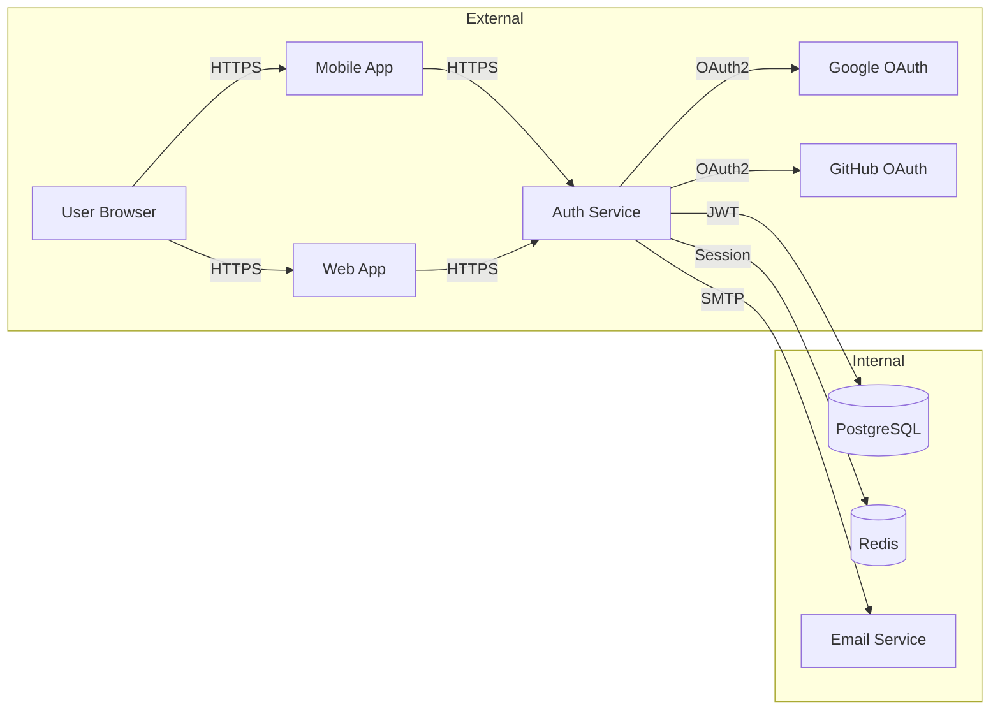
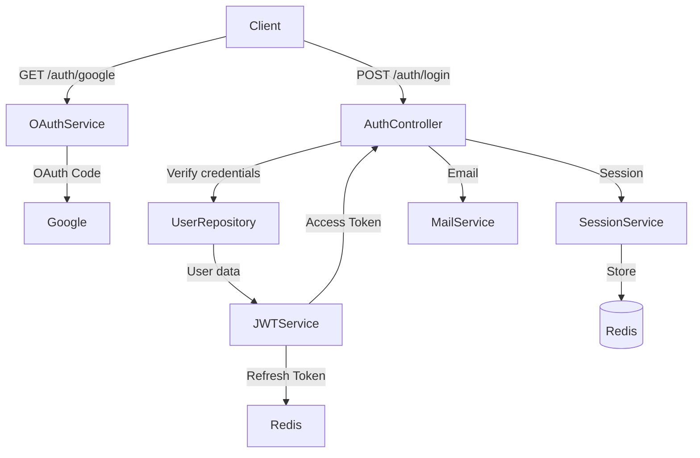
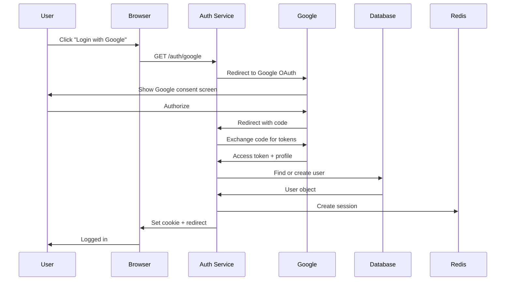

# Architecture: User Authentication System

## Overview

Authentication system với 3 main flows:
1. **OAuth2 Flow** — Google/GitHub login
2. **JWT Flow** — API token authentication
3. **Session Flow** — Web session management

## System Context

### Context Diagram



## Component Architecture

### Components

| Component | Responsibility | Technology | Location |
|-----------|----------------|------------|----------|
| AuthController | Handle auth HTTP requests | Express | `src/controllers/auth.ts` |
| OAuthService | OAuth2 provider integration | Custom | `src/services/oauth.ts` |
| JWTService | Token generation/validation | jsonwebtoken | `src/services/jwt.ts` |
| SessionService | Session management | express-session | `src/services/session.ts` |
| UserRepository | User data access | Prisma | `src/repositories/user.ts` |
| RateLimiter | Brute force protection | express-rate-limit | `src/middleware/rateLimit.ts` |

### Component Diagram



## Data Architecture

### Data Models

#### Entity: User

| Field | Type | Constraints | Description |
|-------|------|------------|-------------|
| id | UUID | PK | Unique identifier |
| email | VARCHAR(255) | UNIQUE, NOT NULL | User email |
| passwordHash | VARCHAR(255) | NULL | Argon2 hash (if email login) |
| name | VARCHAR(100) | NOT NULL | Display name |
| avatarUrl | VARCHAR(500) | NULL | Profile picture |
| provider | ENUM | NOT NULL | 'google', 'github', 'email' |
| providerId | VARCHAR(255) | NULL | OAuth provider ID |
| emailVerified | BOOLEAN | DEFAULT false | Email verified |
| createdAt | TIMESTAMP | DEFAULT NOW() | Creation time |
| updatedAt | TIMESTAMP | DEFAULT NOW() | Last update |

#### Entity: Session

| Field | Type | Constraints | Description |
|-------|------|------------|-------------|
| id | UUID | PK | Unique identifier |
| userId | UUID | FK → users(id) | Owner |
| token | VARCHAR(255) | UNIQUE | Refresh token |
| expiresAt | TIMESTAMP | NOT NULL | Expiry time |
| ipAddress | VARCHAR(45) | NULL | Client IP |
| userAgent | TEXT | NULL | Browser info |
| createdAt | TIMESTAMP | DEFAULT NOW() | Creation time |

### Database Schema

```sql
-- Users table
CREATE TABLE users (
    id UUID PRIMARY KEY DEFAULT gen_random_uuid(),
    email VARCHAR(255) UNIQUE NOT NULL,
    password_hash VARCHAR(255),
    name VARCHAR(100) NOT NULL,
    avatar_url VARCHAR(500),
    provider VARCHAR(20) NOT NULL DEFAULT 'email',
    provider_id VARCHAR(255),
    email_verified BOOLEAN DEFAULT false,
    created_at TIMESTAMP DEFAULT NOW(),
    updated_at TIMESTAMP DEFAULT NOW()
);

-- Sessions table
CREATE TABLE sessions (
    id UUID PRIMARY KEY DEFAULT gen_random_uuid(),
    user_id UUID REFERENCES users(id) ON DELETE CASCADE,
    token VARCHAR(255) UNIQUE NOT NULL,
    expires_at TIMESTAMP NOT NULL,
    ip_address VARCHAR(45),
    user_agent TEXT,
    created_at TIMESTAMP DEFAULT NOW()
);

-- Email verification tokens
CREATE TABLE email_verifications (
    id UUID PRIMARY KEY DEFAULT gen_random_uuid(),
    user_id UUID REFERENCES users(id) ON DELETE CASCADE,
    token VARCHAR(255) UNIQUE NOT NULL,
    expires_at TIMESTAMP NOT NULL,
    created_at TIMESTAMP DEFAULT NOW()
);

-- Password reset tokens
CREATE TABLE password_resets (
    id UUID PRIMARY KEY DEFAULT gen_random_uuid(),
    user_id UUID REFERENCES users(id) ON DELETE CASCADE,
    token VARCHAR(255) UNIQUE NOT NULL,
    expires_at TIMESTAMP NOT NULL,
    used BOOLEAN DEFAULT false,
    created_at TIMESTAMP DEFAULT NOW()
);

-- Indexes
CREATE INDEX idx_users_email ON users(email);
CREATE INDEX idx_users_provider ON users(provider, provider_id);
CREATE INDEX idx_sessions_token ON sessions(token);
CREATE INDEX idx_sessions_user_id ON sessions(user_id);
```

## API Design

### Endpoints

| Method | Endpoint | Description | Auth Required |
|--------|----------|-------------|---------------|
| GET | /auth/google | Redirect to Google OAuth | No |
| GET | /auth/google/callback | Google OAuth callback | No |
| GET | /auth/github | Redirect to GitHub OAuth | No |
| GET | /auth/github/callback | GitHub OAuth callback | No |
| POST | /auth/register | Register new user | No |
| POST | /auth/login | Login with email/password | No |
| POST | /auth/logout | Logout user | Yes |
| POST | /auth/refresh | Refresh access token | Refresh Token |
| POST | /auth/forgot-password | Request password reset | No |
| POST | /auth/reset-password | Reset password with token | No |
| GET | /auth/me | Get current user | Access Token |

### Request/Response Schemas

#### POST /auth/login

**Request:**
```json
{
  "email": "user@example.com",
  "password": "securePassword123"
}
```

**Response (200):**
```json
{
  "user": {
    "id": "uuid",
    "email": "user@example.com",
    "name": "John Doe",
    "avatarUrl": "https://..."
  },
  "accessToken": "eyJhbG...",
  "refreshToken": "eyJhbG...",
  "expiresIn": 900
}
```

#### POST /auth/refresh

**Request:**
```json
{
  "refreshToken": "eyJhbG..."
}
```

**Response (200):**
```json
{
  "accessToken": "eyJhbG...",
  "refreshToken": "eyJhbG...",
  "expiresIn": 900
}
```

## Security Architecture

### Authentication Flow



### JWT Token Structure

```json
{
  "header": {
    "alg": "RS256",
    "typ": "JWT"
  },
  "payload": {
    "sub": "user-uuid",
    "email": "user@example.com",
    "iat": 1712659200,
    "exp": 1712660100,
    "jti": "token-uuid"
  }
}
```

### Security Measures

| Layer | Protection |
|-------|------------|
| Transport | TLS 1.3 |
| Cookie | HTTP-only, Secure, SameSite=Strict |
| Password | Argon2id (memory=64MB, iterations=3) |
| JWT | RS256, 15 min expiry, short-lived |
| Refresh Token | Rotation on use, 7 day expiry |
| Rate Limiting | 5 attempts/minute per IP |
| CORS | Whitelist allowed origins |

## Error Handling

### Error Response Format

```json
{
  "error": {
    "code": "INVALID_CREDENTIALS",
    "message": "Invalid email or password",
    "details": {}
  }
}
```

### Error Codes

| Code | HTTP Status | Description |
|------|-------------|-------------|
| INVALID_CREDENTIALS | 401 | Wrong email/password |
| TOKEN_EXPIRED | 401 | Access token expired |
| TOKEN_INVALID | 401 | Malformed or invalid token |
| USER_NOT_FOUND | 404 | No user with this email |
| EMAIL_TAKEN | 409 | Email already registered |
| RATE_LIMITED | 429 | Too many attempts |
| OAUTH_FAILED | 400 | OAuth provider error |

## Monitoring & Observability

### Metrics

| Metric | Type | Alert Threshold |
|--------|------|----------------|
| login_attempts_total | counter | Anomaly detection |
| login_success_rate | gauge | < 95% |
| auth_latency_p95 | histogram | > 100ms |
| active_sessions | gauge | > threshold |
| rate_limit_hits | counter | > 100/hour |

### Logging

| Event | Level | Fields |
|-------|-------|--------|
| Login attempt | INFO | email, provider, ip, success |
| Login success | INFO | user_id, provider, duration |
| Login failure | WARN | email, reason, ip |
| Token refresh | DEBUG | user_id |
| Rate limit hit | WARN | ip, endpoint |

## Related Documents

- Feature Plan: `./PLAN.md`
- Scope: `./SCOPE.md`
- Tasks: `./TASKS.md`
- Decisions: `./DECISIONS.md`
