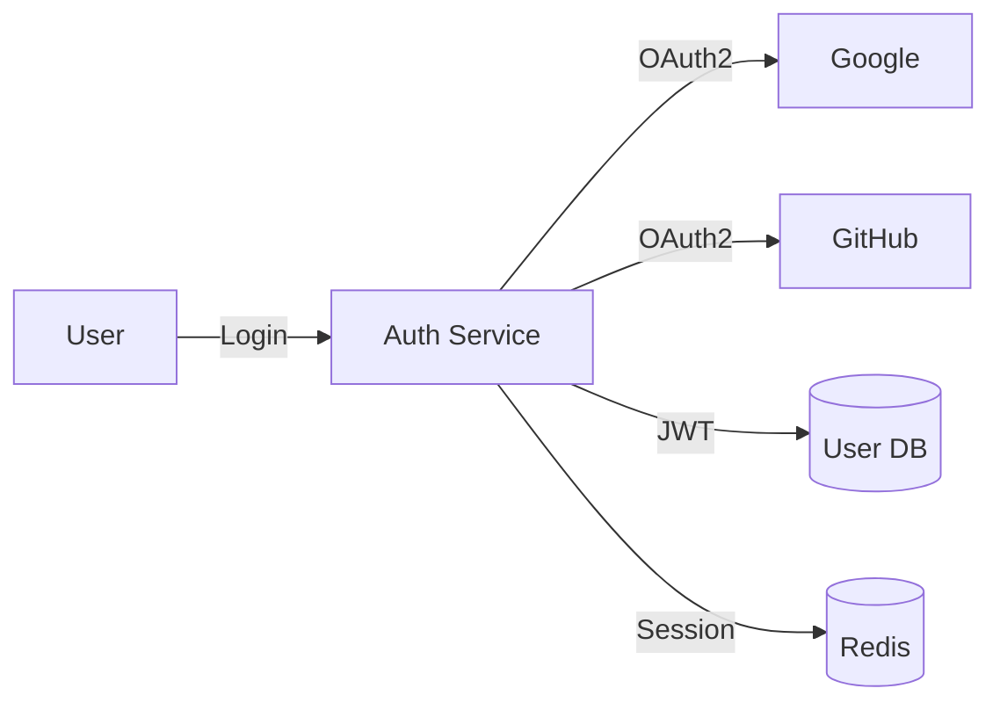

# Feature Plan: User Authentication System

> OAuth2 + JWT authentication cho Forgewright.

## Metadata

| Field | Value |
|-------|-------|
| **Feature Name** | User Authentication System |
| **Created** | 2026-04-10 |
| **Last Updated** | 2026-04-10 |
| **Status** | Planning |
| **Priority** | P0 (Critical) |
| **Estimated Effort** | 24 hours / 3 days |

## Overview

Implement secure authentication system với OAuth2 providers (Google, GitHub) và JWT tokens cho API authentication. Hệ thống sẽ support cả web session và API token-based auth.

## Goals

1. **OAuth2 Login** — Users có thể đăng nhập bằng Google/GitHub
2. **JWT API Auth** — API endpoints protected bằng JWT Bearer tokens
3. **Session Management** — Secure session với HTTP-only cookies
4. **Password Reset** — Forgot password flow với email verification
5. **Account Security** — Rate limiting, brute force protection

## Scope

### ✅ In Scope

- [ ] OAuth2 integration (Google, GitHub)
- [ ] JWT token generation và validation
- [ ] User registration với email verification
- [ ] Login/Logout flow
- [ ] Password reset flow
- [ ] Session management
- [ ] Rate limiting (login attempts)
- [ ] Refresh token rotation

### ❌ Out of Scope

- [ ] Social account linking (v2.0)
- [ ] Two-factor authentication (v2.0)
- [ ] SSO enterprise features (v2.0)
- [ ] Biometric authentication

## Key Decisions

| Decision | Rationale | Status |
|----------|-----------|--------|
| JWT over Sessions for API | Stateless, scalable, better for microservices | Approved |
| OAuth2 providers: Google + GitHub | Most common, easy integration | Approved |
| HTTP-only cookies for web | XSS protection | Approved |
| Refresh token rotation | Security best practice | Approved |
| Argon2 for password hashing | Memory-hard, resistant to GPU attacks | Approved |

## Architecture Summary

Link to full architecture: `./ARCHITECTURE.md`

## Task Breakdown

| Task | Priority | Estimate | Owner | Status |
|------|----------|----------|-------|--------|
| Database schema & migrations | P0 | 2h | | Not Started |
| User model & repository | P0 | 2h | | Not Started |
| OAuth2 Google integration | P0 | 4h | | Not Started |
| OAuth2 GitHub integration | P0 | 4h | | Not Started |
| JWT token generation | P0 | 3h | | Not Started |
| Login/Logout endpoints | P0 | 2h | | Not Started |
| Registration & email verification | P1 | 4h | | Not Started |
| Password reset flow | P1 | 4h | | Not Started |
| Rate limiting middleware | P1 | 2h | | Not Started |
| Unit tests | P0 | 4h | | Not Started |
| Integration tests | P1 | 4h | | Not Started |

**Total Estimated: 35 hours (~4.4 days)**

## Risks & Mitigations

| Risk | Impact | Probability | Mitigation |
|------|--------|-------------|------------|
| OAuth provider downtime | High | Low | Fallback to email/password only |
| Token leakage | High | Low | Short expiry + rotation |
| Brute force attacks | Medium | Medium | Rate limiting + captcha |
| Database breach | Critical | Low | Argon2 + encryption at rest |

## Dependencies

### Internal

- Database connection pool configuration
- Redis for session storage
- Email service (for verification emails)

### External

| Service | Status | Notes |
|---------|--------|-------|
| Google OAuth2 | ✅ Ready | Developer console setup complete |
| GitHub OAuth2 | ✅ Ready | Developer settings ready |
| SendGrid | 🔄 Pending | Need API key |

## Success Criteria

| Criteria | Metric | Target |
|----------|--------|--------|
| Login success rate | % | > 99% |
| Auth latency | ms | < 100ms |
| Security audit | Pass/Fail | Pass (no Critical/High) |
| Test coverage | % | > 80% |

## Timeline

```mermaid
gantt
    title User Auth Timeline
    dateFormat X
    axisFormat %d日

    section Phase 1
    Database & Models    :done, 2026-04-10, 2h
    OAuth2 Google        :active, 2026-04-10, 4h
    OAuth2 GitHub        :2026-04-11, 4h

    section Phase 2
    JWT Tokens           :2026-04-11, 3h
    Login/Logout         :2026-04-12, 2h
    Registration         :2026-04-12, 4h

    section Phase 3
    Password Reset       :2026-04-13, 4h
    Rate Limiting        :2026-04-13, 2h

    section Phase 4
    Testing             :2026-04-14, 8h
```

## Open Questions

| Question | Owner | Answered? |
|----------|-------|-----------|
| Email provider preference? | @user | ❌ |
| Session expiry time? | @user | ❌ |

## Related Documents

- Scope: `./SCOPE.md`
- Architecture: `./ARCHITECTURE.md`
- Tasks: `./TASKS.md`
- Decisions: `./DECISIONS.md`
