# Kiến Trúc Hệ Thống: Tiểu Mơ Engine 4.0
**Mô hình:** Forgewright Level 4 Autonomous Orchestration trên Headless VPS.

Kiến trúc này đánh dấu sự chuyển đổi từ việc điều phối tĩnh (Bash thuần túy) sang luồng điều phối tác tử (Agentic Loop) cho phép AI suy luận (Reasoning) và tự hành động (Acting) trực tiếp trên server qua giao thức Model Context Protocol (MCP).

## Sơ đồ luồng xử lý (Mermaid Diagram)

```mermaid
sequenceDiagram
    autonumber
    participant User as Sếp (Telegram Bot)
    participant TG as Telegram Service (Python)
    participant Bash as task-runner.sh
    participant Orch as Python Agent Orchestrator<br/>(forgewright-orchestrator.py)
    participant MCP as ForgeNexus MCP Server<br/>(npx tsx forgenexus/src/server.ts)
    participant LLM as MiniMax API<br/>(MiniMax-M2.7)

    User->>TG: Gửi tin nhắn Request (Task)
    TG->>Bash: Trigger task-runner.sh<br/>Truyền: TASK, PROJECT, CHAT_ID, REPO_URL
    Note over Bash: Cập nhật state: QUEUED → CLARIFY
    Bash->>Bash: Gọi LLM Clarify + Plan

    alt Sếp Confirm
        Bash->>Orch: Gọi python3 forgewright-orchestrator.py<br/>Truyền: PROJECT_ID, TASK, CODE_DIR
        Note over Orch: Cập nhật state: EXECUTE

        rect rgb(30, 40, 50)
        Note right of Orch: VÒNG LẶP TIỂU MƠ ENGINE 4.0 (Autonomous Loop)
        Orch->>MCP: Khởi tạo stdio_client() + ClientSession.init()
        MCP-->>Orch: Mở luồng, cấp Tools (forgenexus)

        loop Vòng lặp ReAct (Reasoning & Acting)
            Orch->>LLM: Gửi Prompt + Tools Schema
            LLM-->>Orch: Response (tool_calls hoặc text cuối)

            alt LLM quyết định dùng Tool
                Orch->>MCP: session.call_tool(name, args)
                MCP-->>Orch: Tool Result (thành công/lỗi)
                Orch->>LLM: Gửi lại Tool Result
            else LLM hoàn thành Task
                LLM-->>Orch: Response (Nội dung văn bản)
                Note right of Orch: Phát hiện Output cuối cùng → Thoát Loop
            end
        end
        end

        Orch-->>Bash: Exit Code 0, Log → /root/state/orchestrator_${PROJECT}.log
        Bash->>Bash: git add . && git commit && git push
        Bash->>Bash: vercel --prod --yes
        Bash->>TG: Gửi Telegram (Live URL)
        TG-->>User: ✅ Hoàn tất!
    else Sếp Cancel
        TG-->>User: Đã hủy
    end
```



## Trạng thái Task (State Machine)

```
QUEUED → CLARIFY → PLAN → EXECUTE → DEPLOY → READY
                  ↓                    ↓
               TIMEOUT               ERROR
```

| State | Mô tả |
|-------|-------|
| QUEUED | Task vào hàng chờ, chờ lock |
| CLARIFY | Hỏi Sếp 1-2 câu quan trọng nhất |
| PLAN | Lên draft structure |
| EXECUTE | Orchestrator đang chạy MCP Loop |
| DEPLOY | Commit → GitHub → Vercel |
| READY | Hoàn tất, gửi URL |

## Các thành phần cốt lõi

### 1. Bash Queue & Dispatcher (`/root/scripts/task-runner.sh`)
Đóng vai trò như một Tổng Quản lý (Project Manager / Foreman).
Khi có Request từ Telegram, Script này sẽ:
- Khoá tệp (flock) để chia hàng chờ
- CLARIFY: Gọi LLM hỏi Sếp câu hỏi làm rõ
- PLAN: Lên draft structure
- EXECUTE: **Triệu hồi Python Orchestrator** (thay vì tự viết code)
- DEPLOY: Commit → GitHub → Vercel
- Cập nhật trạng thái ra Dashboard (`progress_$PROJECT.json`)

### 2. Python Agent Orchestrator (`/root/scripts/forgewright-orchestrator.py`)
Đóng vai trò là Nhạc trưởng (MCP Client).
Nhiệm vụ duy trì **vòng lặp ReAct (Reasoning & Acting):**
- Kết nối MCP Server qua stdio
- Chuyển đổi Tools từ ForgeNexus sang MiniMax schema
- Nhận yêu cầu gọi Tool từ AI
- Gọi subprocess cho MCP để thực thi Tool
- Lấy kết quả cho LLM phân tích tiếp

**Usage:**
```bash
python3 forgewright-orchestrator.py <PROJECT_ID> <TASK> [CODE_DIR]
```

### 3. ForgeNexus MCP Server (`/root/forgewright/forgenexus/src/server.ts`)
Đóng vai trò Bàn Thao Tác (Toolbox / Capability Engine).
Chạy ngầm thông qua subprocess `npx tsx forgenexus/src/server.ts`, cung cấp các Tools:
- `ctx_execute` - Chạy lệnh terminal
- `read_file` - Đọc file
- `write_file` - Viết file mới
- `replace_in_file` - Thay thế nội dung file
- `search` - Tìm kiếm nội dung
- `glob` - Tìm file theo pattern

Sandboxing giới hạn hoạt động trong thư mục dự án.

### 4. Vercel & GitHub
Sau khi Orchestrator thoát vòng lặp:
- Bash take over lại
- Commit lên GitHub
- Deploy Vercel (--prod)
- Cài đặt Subdomain tự động
- Trả kết quả về Sếp qua Telegram

## File System Layout trên VPS

```
/root/
├── scripts/
│   ├── task-runner.sh           # Main dispatcher
│   ├── forgewright-orchestrator.py  # MCP Agent Loop
│   ├── telegram-listener.py     # Telegram bot listener
│   └── memory-wrapper.py        # Context memory
├── forgewright/
│   └── forgenexus/
│       ├── src/server.ts        # MCP Server
│       └── dist/                # Compiled JS
├── projects/
│   └── <PROJECT_NAME>/
│       ├── code/                # Source code
│       └── forgenexus_db/       # Isolated context DB
└── state/
    ├── progress_<PROJECT>.json  # Task status
    ├── orchestrator_<PROJECT>.log   # Execution log
    └── lock_<PROJECT>.lock      # Flock file
```
