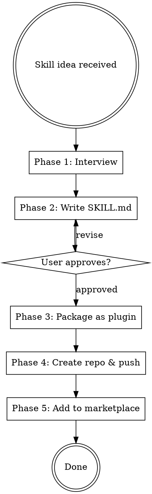

# Skill Maker

## Protocols

!`cat Antigravity-Production-Grade-Suite/.protocols/ux-protocol.md 2>/dev/null || true`
!`cat Antigravity-Production-Grade-Suite/.protocols/input-validation.md 2>/dev/null || true`
!`cat Antigravity-Production-Grade-Suite/.protocols/tool-efficiency.md 2>/dev/null || true`
!`cat .production-grade.yaml 2>/dev/null || echo "No config — using defaults"`

**Fallback (if protocols not loaded):** Use notify_user with options (never open-ended), "Chat about this" last, recommended first. Work continuously. Print progress constantly. Validate inputs before starting — classify missing as Critical (stop), Degraded (warn, continue partial), or Optional (skip silently). Use parallel tool calls for independent reads. Use view_file_outline before full Read.

## Overview

End-to-end skill and plugin creation pipeline. Interviews the user on what the skill should do, writes the SKILL.md, packages it as a Antigravity plugin, creates a GitHub repo, and adds it to the user's marketplace — all in one flow.

## Config Paths

Read `.production-grade.yaml` at startup if available. Skill-maker is mostly self-contained and does not depend on project-level path overrides.

## When to Use

- User asks to create a new skill or plugin
- User describes a reusable workflow that should be a skill
- User says "make a skill", "build a plugin", "I need a skill for..."
- NOT for: editing existing skills (just edit the file directly)

## Process Flow



## Phase 1: Interview (Quick)

Ask 3-4 questions using notify_user, one at a time:

1. **What does this skill do?** — Core purpose in one sentence
2. **When should it trigger?** — Specific words, patterns, or situations
3. **What's the workflow?** — Steps the skill should follow (linear, loop, decision tree?)
4. **Skill type?** — Options: Technique (steps to follow), Pattern (mental model), Reference (docs/API guide), Workflow (multi-phase process)

## Phase 2: Write SKILL.md

Follow these rules from the writing-skills methodology:

**Frontmatter:**
- `name`: kebab-case, letters/numbers/hyphens only
- `description`: Start with "Use when...", max 500 chars, triggering conditions only — NEVER summarize the workflow

**Structure:**
```markdown
---
name: skill-name
description: Use when [triggering conditions]
---

# Skill Name

## Overview
Core principle in 1-2 sentences.

## When to Use
Bullet list with symptoms and use cases.

## Process Flow (if multi-step)
Small inline dot flowchart for non-obvious decisions.

## [Core Content]
Steps, patterns, or reference material.

## Common Mistakes
Table of mistake -> fix pairs.
```

**Quality rules:**
- One excellent example beats many mediocre ones
- Flowcharts ONLY for non-obvious decision points
- Keep under 500 words for standard skills
- Use active voice, verb-first naming
- Include keywords for discoverability (error messages, symptoms, tool names)

**Present the SKILL.md to the user and ask for approval** using notify_user before proceeding.

## Phase 3: Install Skill

Place the generated SKILL.md directly in the project's skills directory:

```
skills/
└── <skill-name>/
    └── SKILL.md
```

The skill is immediately available for use — Antigravity loads skills directly from the `skills/` directory. No packaging or marketplace registration needed.

1. Create the skill directory: `mkdir -p skills/<skill-name>/`
2. Write the SKILL.md to `skills/<skill-name>/SKILL.md`
3. For complex skills with phases, create sub-files: `skills/<skill-name>/phases/*.md`
4. Report to user: `✓ Skill "<skill-name>" installed to skills/<skill-name>/SKILL.md`

## Phase 4: Create Repo & Push (Optional)

If the user wants to share the skill publicly:

1. Create a standalone directory for the skill
2. `git init` in the skill directory
3. `git add -A && git commit -m "Initial release: <skill-name> skill v1.0.0"`
4. `gh repo create <skill-name>-skill --public --source . --push`
5. If `gh` auth fails, guide user through `gh auth login`

## Common Mistakes

| Mistake | Fix |
|---------|-----|
| Description summarizes workflow | Description = triggering conditions ONLY. "Use when..." |
| Special chars in name | Letters, numbers, hyphens only. No parentheses. |
| Skill too verbose (500+ words) | Cut ruthlessly. One example, not five. |
| Missing keywords for discovery | Add error messages, symptoms, tool names in the content |
| Not placing in skills/ directory | Skills go in `skills/<name>/SKILL.md` for auto-loading |
